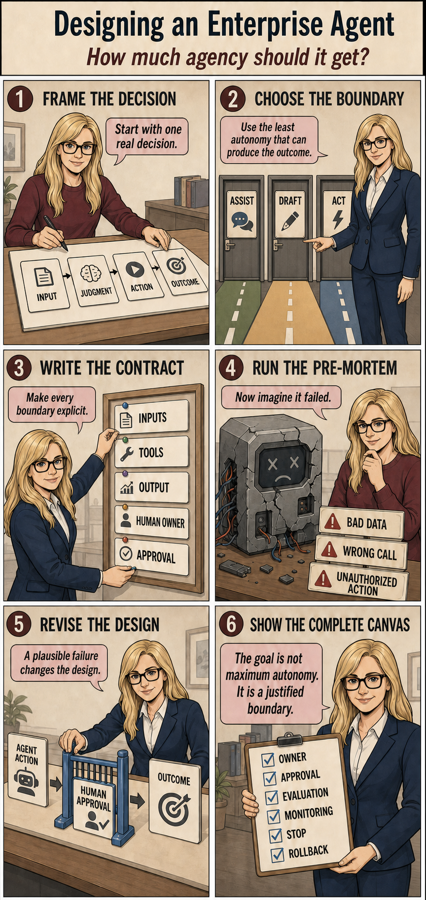

# Enterprise Agent Design Lab

**AICC 2026 · Content created by Vetitek**  
Presented by **Jandee Richards & Will Duffy**.

An agent proposal should explain more than what the model can do. It should explain what authority the system needs, who remains accountable, how mistakes become visible, and how the work stops safely.

This lab turns those questions into a short, hands-on workshop. Participants choose one hypothetical business process, examine whether autonomy adds value, and leave with an **Agent Experiment Canvas**: a decision record and a bounded test plan they can challenge.

> **This is a lab for a workshop, not a production enterprise-agent design framework or a production-ready application.** Its rubric is a teaching aid, not an organizational risk assessment or deployment approval. The application does not connect to participants' enterprise systems or let the model execute tools. Even a “bounded agentic pilot” result means planning an offline simulation with synthetic or sanitized material—not permission to deploy an autonomous agent.

## What we want participants to learn

By the end of the exercise, participants should be able to:

- Distinguish work that needs fixed rules, AI assistance, or limited delegated authority.
- Explain why an agent is—or is not—justified for a particular process.
- Name the human owner, approval boundary, and an observable stop condition.
- Recognize that detecting an error and recovering from it matter as much as producing an answer.
- Use a plausible failure to revise a proposed boundary or safeguard.

These are learning objectives. This pack does not claim to have measured learning gains or validated the rubric across industries.

## Start here

| If you want to…                                            | Read or open                                                                                                                                                                    |
| ---------------------------------------------------------- | ------------------------------------------------------------------------------------------------------------------------------------------------------------------------------- |
| See the talk delivered directly before the lab             | [Are Your Enterprise Systems Ready for Agents?](slides/AICC2026_IsYourEnterpriseReadyforAgents.pptx) — the supplied eight-slide deck, unchanged, with speaker notes and sources |
| Understand the design decisions and three review subagents | [How we built and revised the lab](HOW_WE_BUILT_AND_REVISED_THE_LAB.md)                                                                                                         |
| See the original requests, including their weaknesses      | [v1 specification](specs/v1-spec.md), then [v2 specification](specs/v2-spec.md)                                                                                                 |
| Adapt the code to another guided Q&A process               | [Developer guide](docs/ADAPTING_THE_QA_FLOW.md)                                                                                                                                 |
| Run a workshop                                             | [Facilitator guide](docs/FACILITATOR_GUIDE.md)                                                                                                                                  |
| Understand what information leaves the browser             | [Privacy, data flow, and limitations](docs/PRIVACY_AND_LIMITATIONS.md)                                                                                                          |
| Check what was removed from this public copy               | [Public-pack notes](docs/PUBLIC_PACK_NOTES.md)                                                                                                                                  |

## From the talk to the exercise

The preceding talk frames enterprise readiness around **attribution, limits, and recovery**. The lab applies that lens to one process: Who owns the decision? What may the system do? How would we detect a wrong result, stop, and recover?

The participant journey is:

1. **Choose safe material.** Acknowledge the safety notice and describe a hypothetical or generalized process and desired outcome.
2. **Describe the work.** Select facts about workload, judgment, information sources, permitted actions, consequences, detection, and reversibility.
3. **Make the judgment explicit.** Describe a difficult case and supply an owner role, approver role, and measurable stop rule.
4. **Inspect the recommendation.** See the rule that shaped the result, a short decision summary, and an expandable plan.
5. **Challenge the plan.** Use the optional failure exercise to revise the stop rule, then discuss what changed. Facilitators should make room for this learning step even though the interface does not require it.
6. **Keep or share the result.** Copy or print the plan, open a draft in the participant's email app, or explicitly share the completed canvas with the facilitator. The application does not send email.

| Design choice           | Participant-facing label      | What the exercise asks you to consider                                             |
| ----------------------- | ----------------------------- | ---------------------------------------------------------------------------------- |
| Conventional Automation | Fixed-rule automation         | Can written rules and a predictable path do the work?                              |
| AI Assistance           | AI prepares; a person decides | Can interpretation or drafting help while a person retains the decision?           |
| Bounded Agentic Pilot   | Limited agent simulation      | Is a narrowly bounded, observable, reversible multi-step simulation worth testing? |
| No AI at This Time      | Do not test AI yet            | Which process, ownership, or control questions must be resolved first?             |

## Why we designed it this way

**Spend the workshop on judgment.** Structured choices collect routine facts quickly on a phone. Writing is reserved for exceptions, accountability, and stop conditions.

**Make the recommendation explainable.** Application rules select the category and required controls. The model supplies explanatory language and coaching. Participants can inspect the deciding rule instead of treating fluent prose as evidence.

**Teach safeguards through consequences.** A scripted poisoned-document demonstration shows an attempted action stopped by an approval boundary. Prepared examples vary detectability to show why the same proposed work can justify different limits. Neither demonstration executes real business actions.

**Design for the room.** Prepared examples, standard fallback plans, and optional sharing keep the discussion useful when model generation or shared storage is unavailable. A short generated report is only the starting point; the discussion and revision are the learning activity.

The [build narrative](HOW_WE_BUILT_AND_REVISED_THE_LAB.md) explains how v1, v2, and the educational-design, executive-content, and UX reviews arrived at this design.

The cartoon summarizes the learning sequence: frame the decision, choose the boundary, define the contract, consider failure, revise, and document the controls. It depicts the design conversation, not actions executed by this application.



## Run locally

Use Node.js 24 and the checked-in npm lockfile. From this folder:

```sh
npm ci
```

Copy `.env.example` to `.env.local` (`cp .env.example .env.local` on macOS/Linux; `Copy-Item .env.example .env.local` in PowerShell), then:

```sh
npm run dev
```

Open [localhost:3000](http://localhost:3000). For a first look without credentials, visit [`/facilitator/demo`](http://localhost:3000/facilitator/demo), [`/facilitator/injection`](http://localhost:3000/facilitator/injection), [`/takeaway`](http://localhost:3000/takeaway), or [`/review/all-screens`](http://localhost:3000/review/all-screens). These pages require the local server but no live model request. They are not a claim that a remotely hosted website works without network access.

For model-written plans and coaching, configure your own server-side `OPENAI_API_KEY` and `OPENAI_MODEL`. No key or model is supplied. The current v2 canvas path can fall back to a standard plan when generation fails; legacy interview routes still require model access. See the [developer guide](docs/ADAPTING_THE_QA_FLOW.md) for configuration and tests.

## Boundaries before reuse

Use hypothetical or sanitized information only. No names, employers, email addresses, confidential records, credentials, or regulated details belong in the exercise. **No login does not mean no data leaves the device:** model-backed requests send submitted context through the server to the model provider. Optional sharing stores the completed canvas, not the full Q&A transcript, and has **no automatic expiry** in this code. See the [data-flow guide](docs/PRIVACY_AND_LIMITATIONS.md).

This pack contains source, tests, historical specifications, the supplied talk, and documentation. It contains no participant exports, secret files, deployment identifiers, or hosted-service targets. The **code and technical documentation are MIT licensed**; the deck and workshop materials have separate terms. See [license and reuse](REUSE.md).
