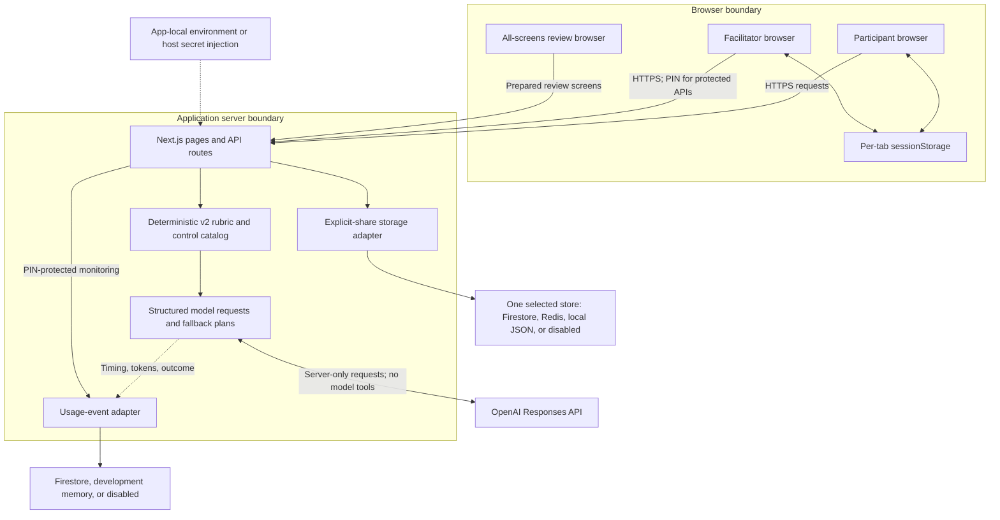
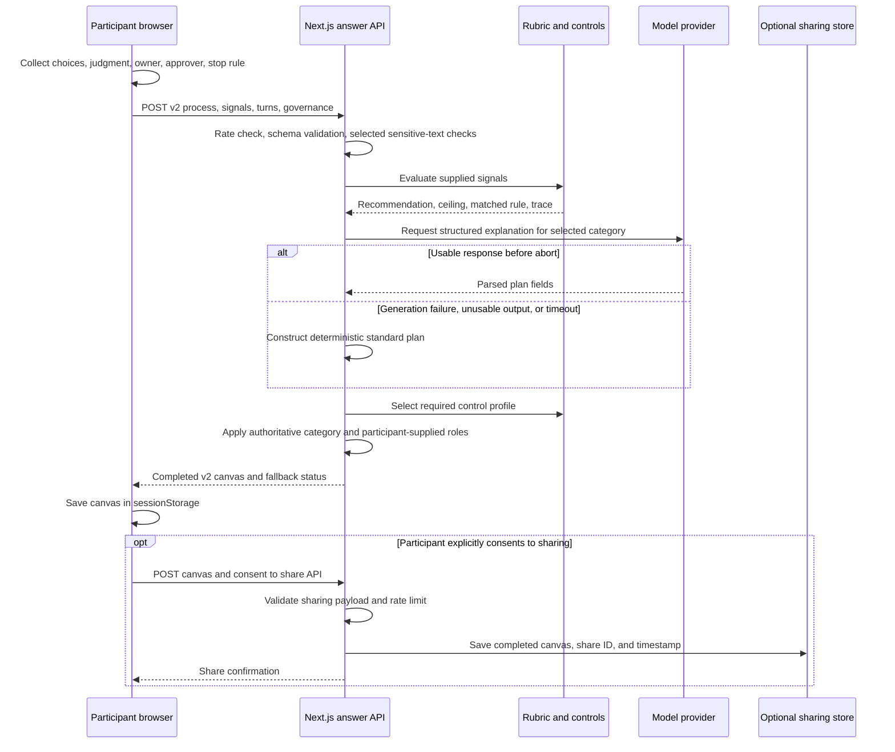
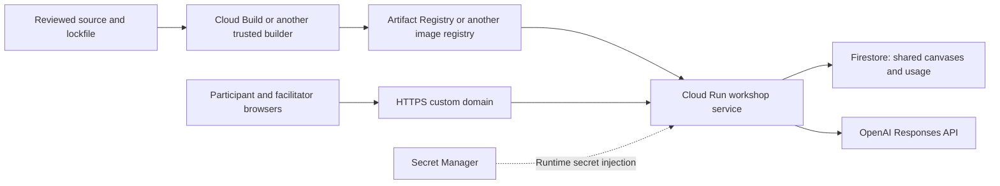

# Enterprise Agent Design Lab

**AICC 2026 · Content created by Vetitek**  
Presented by **Jandee Richards & Will Duffy**.

An agent proposal should explain more than what the model can do. It should explain what authority the system needs, who remains accountable, how mistakes become visible, and how the work stops safely.

This lab turns those questions into a short, hands-on workshop. Participants choose one hypothetical business process, examine whether autonomy adds value, and leave with an **Agent Experiment Canvas**: a decision record and a bounded test plan they can challenge.

> **This is a lab for a workshop, not a production enterprise-agent design framework or a production-ready application.** Its rubric is a teaching aid, not an organizational risk assessment or deployment approval. The application does not connect to participants' enterprise systems or let the model execute tools. Even a “bounded agentic pilot” result means planning an offline simulation with synthetic or sanitized material—not permission to deploy an autonomous agent.

## What we want participants to learn

By the end of the exercise, participants should be able to:

- Distinguish work that needs fixed rules, AI assistance, or limited delegated authority.
- Explain why an agent is—or is not—justified for a particular process.
- Name the human owner, approval boundary, and an observable stop condition.
- Recognize that detecting an error and recovering from it matter as much as producing an answer.
- Use a plausible failure to revise a proposed boundary or safeguard.

These are learning objectives. This pack does not claim to have measured learning gains or validated the rubric across industries.

## Start here

| If you want to…                                            | Read or open                                                                                                                                                                    |
| ---------------------------------------------------------- | ------------------------------------------------------------------------------------------------------------------------------------------------------------------------------- |
| See the talk delivered directly before the lab             | [Are Your Enterprise Systems Ready for Agents?](slides/AICC2026_IsYourEnterpriseReadyforAgents.pptx) — the supplied eight-slide deck, unchanged, with speaker notes and sources |
| Understand the design decisions and three review subagents | [How we built and revised the lab](HOW_WE_BUILT_AND_REVISED_THE_LAB.md)                                                                                                         |
| See the original requests, including their weaknesses      | [v1 specification](specs/v1-spec.md), then [v2 specification](specs/v2-spec.md)                                                                                                 |
| Adapt the code to another guided Q&A process               | [Developer guide](docs/ADAPTING_THE_QA_FLOW.md)                                                                                                                                 |
| Run a workshop                                             | [Facilitator guide](docs/FACILITATOR_GUIDE.md)                                                                                                                                  |
| Understand what information leaves the browser             | [Privacy, data flow, and limitations](docs/PRIVACY_AND_LIMITATIONS.md)                                                                                                          |
| Check what was removed from this public copy               | [Public-pack notes](docs/PUBLIC_PACK_NOTES.md)                                                                                                                                  |

## From the talk to the exercise

The preceding talk frames enterprise readiness around **attribution, limits, and recovery**. The lab applies that lens to one process: Who owns the decision? What may the system do? How would we detect a wrong result, stop, and recover?

The participant journey is:

1. **Choose safe material.** Acknowledge the safety notice and describe a hypothetical or generalized process and desired outcome.
2. **Describe the work.** Select facts about workload, judgment, information sources, permitted actions, consequences, detection, and reversibility.
3. **Make the judgment explicit.** Describe a difficult case and supply an owner role, approver role, and measurable stop rule.
4. **Inspect the recommendation.** See the rule that shaped the result, a short decision summary, and an expandable plan.
5. **Challenge the plan.** Use the optional failure exercise to revise the stop rule, then discuss what changed. Facilitators should make room for this learning step even though the interface does not require it.
6. **Keep or share the result.** Copy or print the plan, open a draft in the participant's email app, or explicitly share the completed canvas with the facilitator. The application does not send email.

| Design choice           | Participant-facing label      | What the exercise asks you to consider                                             |
| ----------------------- | ----------------------------- | ---------------------------------------------------------------------------------- |
| Conventional Automation | Fixed-rule automation         | Can written rules and a predictable path do the work?                              |
| AI Assistance           | AI prepares; a person decides | Can interpretation or drafting help while a person retains the decision?           |
| Bounded Agentic Pilot   | Limited agent simulation      | Is a narrowly bounded, observable, reversible multi-step simulation worth testing? |
| No AI at This Time      | Do not test AI yet            | Which process, ownership, or control questions must be resolved first?             |

## Why we designed it this way

**Spend the workshop on judgment.** Structured choices collect routine facts quickly on a phone. Writing is reserved for exceptions, accountability, and stop conditions.

**Make the recommendation explainable.** Application rules select the category and required controls. The model supplies explanatory language and coaching. Participants can inspect the deciding rule instead of treating fluent prose as evidence.

**Teach safeguards through consequences.** A scripted poisoned-document demonstration shows an attempted action stopped by an approval boundary. Prepared examples vary detectability to show why the same proposed work can justify different limits. Neither demonstration executes real business actions.

**Design for the room.** Prepared examples, standard fallback plans, and optional sharing keep the discussion useful when model generation or shared storage is unavailable. A short generated report is only the starting point; the discussion and revision are the learning activity.

The [build narrative](HOW_WE_BUILT_AND_REVISED_THE_LAB.md) explains how v1, v2, and the educational-design, executive-content, and UX reviews arrived at this design.

The cartoon summarizes the learning sequence: frame the decision, choose the boundary, define the contract, consider failure, revise, and document the controls. It depicts the design conversation, not actions executed by this application.


## Run locally

Use Node.js 24 and the checked-in npm lockfile. From this folder:

```sh
npm ci
```

Copy `.env.example` to `.env.local` (`cp .env.example .env.local` on macOS/Linux; `Copy-Item .env.example .env.local` in PowerShell), then:

```sh
npm run dev
```

Open [localhost:3000](http://localhost:3000). For a first look without credentials, visit [`/facilitator/demo`](http://localhost:3000/facilitator/demo), [`/facilitator/injection`](http://localhost:3000/facilitator/injection), [`/takeaway`](http://localhost:3000/takeaway), or [`/review/all-screens`](http://localhost:3000/review/all-screens). These pages require the local server but no live model request. They are not a claim that a remotely hosted website works without network access.

For model-written plans and coaching, configure your own server-side `OPENAI_API_KEY` and `OPENAI_MODEL`. No key or model is supplied. The current v2 canvas path can fall back to a standard plan when generation fails; legacy interview routes still require model access. See the [developer guide](docs/ADAPTING_THE_QA_FLOW.md) for configuration and tests.

## Boundaries before reuse

Use hypothetical or sanitized information only. No names, employers, email addresses, confidential records, credentials, or regulated details belong in the exercise. **No login does not mean no data leaves the device:** model-backed requests send submitted context through the server to the model provider. Optional sharing stores the completed canvas, not the full Q&A transcript, and has **no automatic expiry** in this code. See the [data-flow guide](docs/PRIVACY_AND_LIMITATIONS.md).

This pack contains source, tests, historical specifications, the supplied talk, and documentation. It contains no participant exports, secret files, deployment identifiers, or hosted-service targets. The **code and technical documentation are MIT licensed**; the deck and workshop materials have separate terms. See [license and reuse](REUSE.md).

## Technical reference

The sections below document the public source snapshot and restore the engineering context behind the workshop. They supplement the material above. Architecture diagrams use generic component names; no original cloud project, service account, hostname, or deployment target is included. A hosted workshop service is still an educational application, not a production enterprise-agent system.

- [Architecture and trust boundaries](#architecture-and-trust-boundaries)
- [Technical design decisions](#technical-design-decisions)
- [Decision policy and data contracts](#decision-policy-and-data-contracts)
- [Model calls, timeouts, and fallbacks](#model-calls-timeouts-and-fallbacks)
- [Configuration reference](#configuration-reference)
- [Pages and API routes](#pages-and-api-routes)
- [Storage, retention, and observability](#storage-retention-and-observability)
- [Container and hosted-workshop architecture](#container-and-hosted-workshop-architecture)
- [Capacity planning and historical test evidence](#capacity-planning-and-historical-test-evidence)
- [Threat model](#threat-model)
- [Operational checks and troubleshooting](#operational-checks-and-troubleshooting)
- [Testing and repository map](#testing-and-repository-map)

### Architecture and trust boundaries

The application is one Next.js App Router service. It serves the participant and facilitator interfaces, validates API requests, evaluates the rubric, requests model-written content, and accesses optional storage. There is no agent execution service, background tool loop, or connection to a participant's business systems.



`sessionStorage` is shown once for readability. Participant state and the facilitator PIN use separate keys and are held in their respective browser tabs; this is not an authorization boundary against script execution on the same origin. A participant controls the requests and local state sent from their browser. The server must not treat that state as trusted evidence.

The external model boundary is also explicit: the current v2 flow sends process context, structured signals, and judgment answers through the server for generation. Browser storage does not mean the activity is processed entirely on-device. Explicit sharing is a separate persistence decision.

| Layer                          | Implementation                                         | Responsibility                                                                           |
| ------------------------------ | ------------------------------------------------------ | ---------------------------------------------------------------------------------------- |
| Interface                      | React, TypeScript, Tailwind CSS, Next.js App Router    | Mobile intake, decision summary, full canvas, facilitator and review screens             |
| Request and response contracts | Zod                                                    | Validate fields, lengths, supported values, and structured model output                  |
| Decision policy                | `src/lib/rubric.ts`                                    | Select the current v2 recommendation, autonomy ceiling, triggers, and decision trace     |
| Safeguards vocabulary          | `src/lib/control-catalog.ts`                           | Attach a deterministic control profile and explain each control's purpose                |
| Model integration              | OpenAI Node SDK and Responses API                      | Write the bounded explanation, process-specific failure scenarios, and revision coaching |
| Recovery                       | `src/lib/canvas-fallback.ts`, `src/lib/pre-mortem.ts`  | Supply standard plans and deterministic failure modes when generation is unavailable     |
| State                          | Browser session storage                                | Recover participant progress after a refresh when storage is available                   |
| Sharing                        | Firestore, Upstash Redis REST, local JSON, or disabled | Persist only explicitly submitted completed canvases                                     |
| Monitoring                     | Firestore, development memory, or disabled             | Record content-free model-usage events                                                   |
| Packaging                      | Multi-stage Dockerfile and Next.js standalone output   | Build a container without embedding credentials                                          |

The educational-design, executive-content, and UX subagents belong to the **development process**, described above. None is a runtime component in these diagrams.

#### Current v2 request sequence



This sequence describes the current v2 path, not the retained legacy interview. The sharing route validates a client-supplied canvas; it does not cryptographically attest that the canvas came from the answer route or recompute every decision. A shared result is workshop material, not a verified decision record.

### Technical design decisions

| Decision                                                | Why it fits this lab                                                          | Tradeoff or limit                                                                                       |
| ------------------------------------------------------- | ----------------------------------------------------------------------------- | ------------------------------------------------------------------------------------------------------- |
| One web service, no participant accounts                | Reduces workshop setup and lets participants start from a phone               | No durable identity, cross-device continuity, or individual administrator audit trail                   |
| Structured facts plus a small amount of writing         | Saves interaction time for exceptions and accountability                      | Categories simplify real processes; the rubric needs domain review before reuse                         |
| Deterministic current-v2 category and required controls | Makes the recommendation inspectable and repeatable for the same signals      | Determinism does not prove that the rule is correct or that the inputs are true                         |
| Model-written explanation separated from classification | Allows tailored prose without delegating the category to the model            | Prose can still be wrong, inconsistent, or influenced by hostile input                                  |
| Participant-supplied owner, approver, and stop rule     | Prevents the model from inventing accountable roles                           | A role string does not establish that the person or organization accepted responsibility                |
| Structured output and server-side validation            | Gives the interface a predictable contract and bounds accepted input          | Schema validity is not factual accuracy, policy compliance, or complete privacy screening               |
| No model tools, uploads, or enterprise connectors       | Keeps the exercise from taking real business actions                          | The lab cannot demonstrate actual permission enforcement, rollback, or enterprise integration readiness |
| Session storage and explicit sharing                    | Keeps draft persistence local and makes facilitator sharing a separate choice | Drafts are vulnerable to same-origin script access; a shared copy has a different lifecycle             |
| Optional revision and progressive disclosure            | Keeps the plan accessible while encouraging a focused failure exercise        | Completion does not prove that a participant challenged or improved the design                          |
| Fixed examples and deterministic fallbacks              | Keeps a workshop discussion usable during service degradation                 | A fallback is less tailored; it should not be presented as personalized model analysis                  |
| A shared facilitator PIN                                | Simple access control for a short workshop                                    | Not enterprise authentication, role-based access control, or brute-force protection                     |
| A static all-screens review route                       | Makes content and interface states easy to review together                    | Unlinked and `noindex` do not make it private; it must contain only safe prepared material              |

### Decision policy and data contracts

The current rubric has version `2026-08-24`. It combines technical fit, an AI autonomy ceiling, and a coarse economic cap. The implementation's ordering matters:

1. **Recognize fixed-rule work first.** Stable rules, fixed steps, and little or no judgment select Conventional Automation. This category is outside the AI autonomy ladder; it is not a declaration that every non-AI automation would be safe.
2. **Calculate the AI ceiling.** Effectively irreversible results that may remain hidden for months produce a `None` ceiling. A required or unconfirmed human decision, certain regulated-impact combinations, or a proposed transaction with weak detection cap autonomy at `Assistance`.
3. **Apply the economic cap for non-fixed work.** Under five hours of monthly staff effort caps the result at assistance. Older inputs without that field use a low frequency/volume rule. This is a workshop heuristic, not a financial return calculation.
4. **Check bounded multi-step fit.** A bounded result requires a compatible ceiling, actions beyond drafting, multiple systems, a path that can vary, timely detection, and reversibility. Otherwise the outcome stays at assistance.

The output records `rubricVersion`, `matchedRuleId`, `autonomyCeiling`, `triggers`, and `trace`. The control catalog attaches outcome-specific safeguards. For AI outcomes, document/message or outside-content sources add the untrusted-input control. A control listed on a canvas is a design requirement for the proposed test; it does not mean this app implements that control against a real system.

| Contract                  | Important fields and limits                                                                                                                                      |
| ------------------------- | ---------------------------------------------------------------------------------------------------------------------------------------------------------------- |
| Process                   | Name: 3–80 characters; outcome: 10–300; optional business function; safety acknowledgment must be `true`                                                         |
| Signals                   | Twelve original categorical signals, plus optional monthly effort and judgment share for compatibility; current intake collects the additional economics context |
| Current v2 answer request | `version: 2`, process, signals, exactly two judgment turns, and governance                                                                                       |
| Judgment turn             | Answer: 8–1,000 characters; the second turn includes the governance response assembled by the interface                                                          |
| Governance                | Owner and approver roles: 3–80 characters; stop rule: 20–300, with selected uncertainty phrases rejected                                                         |
| Canvas                    | Version, UUID, timestamp, process, generated plan fields, recommendation, and—on v2—signals, rubric trace, and required controls                                 |
| Revision                  | V2 canvas, 2–4 failure modes, and 20–500 characters of specific revision text                                                                                    |
| Sharing                   | A supported canvas and explicit `consent: true`                                                                                                                  |

The schema still contains compatibility fields such as generated `confidence`; a field's presence in the data contract is not a calibrated confidence measure. Both v1 and v2 canvases are accepted by the sharing schema. The legacy six-question API still permits a model-selected recommendation, so the current v2 guarantee must not be applied to every endpoint indiscriminately.

Implementation: [schemas](src/lib/schemas.ts), [rubric](src/lib/rubric.ts), [control catalog](src/lib/control-catalog.ts), [answer route](src/app/api/interview/answer/route.ts), and [fallback quality check](src/lib/canvas-fallback.ts).

### Model calls, timeouts, and fallbacks

All model requests are made server-side through [the OpenAI client](src/lib/openai.ts). The current settings are `store: false`, `tools: []`, structured JSON output parsed with Zod, and `reasoning: { effort: "none" }`. `OPENAI_MODEL` is required when a model call is attempted. These settings must be compatible with the model an operator selects; this pack does not choose one.

| Operation                          | Maximum output tokens | Time and failure behavior                                                                                                                                      |
| ---------------------------------- | --------------------- | -------------------------------------------------------------------------------------------------------------------------------------------------------------- |
| Current v2 canvas                  | 2,500                 | The route aborts the model request after 25 seconds. A generation error, missing/unusable output, or abort selects the standard plan.                          |
| Legacy canvas                      | 2,500                 | Uses the SDK timeout; it does not have the current v2 deterministic-plan fallback.                                                                             |
| Legacy next question               | 300                   | Uses the SDK timeout; errors return through the legacy API error path.                                                                                         |
| Process-specific failure scenarios | 700                   | A 12-second abort; two deterministic failure modes remain available if generation fails. Successful output adds two generated scenarios, capped at four total. |
| Revision coaching                  | 300                   | A 12-second abort; failure returns a fixed prompt to make the rule observable and assign a stop owner.                                                         |

The SDK is configured with a 30-second timeout and `maxRetries: 0`. There is no automatic schema-correction retry loop in this source snapshot, despite earlier specifications requesting one. These are model-request limits, not a guaranteed total HTTP response time; validation, telemetry writes, storage, and network overhead also contribute.

After current-v2 generation, the server sets the recommendation from the rubric, attaches the deterministic control profile, replaces the owner and approval fields using the participant's governance input, and places the supplied stop rule first. Falling back changes the writing source, not the selected category. Revision coaching returns text; the client applies and stores the participant's revision and before/after information.

`store: false` is a request option, not a blanket promise about provider retention or host logs. The telemetry schema excludes participant prose, but application error logs and the hosting platform still require review.

### Configuration reference

Credentials belong in app-local `.env.local` for local use or in the host's secret-injection mechanism. Do not use `NEXT_PUBLIC_` for any secret. The public copy deliberately does not load a parent workspace's environment file.

| Variable                     | When used                                  | Behavior                                                                              |
| ---------------------------- | ------------------------------------------ | ------------------------------------------------------------------------------------- |
| `OPENAI_API_KEY`             | Live model requests                        | Server-only credential supplied by the operator; never bundled with this pack         |
| `OPENAI_MODEL`               | Live model requests                        | Required accessible model identifier; no hardcoded fallback                           |
| `FACILITATOR_PIN`            | Facilitator data reads and both purge APIs | Fails closed when absent; sent in `x-facilitator-pin`                                 |
| `GOOGLE_CLOUD_PROJECT`       | Firestore selection                        | Takes precedence over `GCP_PROJECT_ID`                                                |
| `GCP_PROJECT_ID`             | Firestore selection                        | Optional project configuration; no original project value is provided                 |
| `FIRESTORE_COLLECTION`       | Shared canvases                            | Optional override; generic code default is `agent-design-lab-submissions`             |
| `FIRESTORE_USAGE_COLLECTION` | Model usage events                         | Optional override; defaults to the submissions collection name plus `-usage`          |
| `REDIS_URL`, `REDIS_TOKEN`   | Alternate sharing store                    | Both required; Upstash REST adapter is selected only when no project ID is configured |
| `LOCAL_SHARE_FILE`           | Local development sharing                  | Optional path override; defaults to `.data/submissions.json`                          |
| `PORT`, `HOSTNAME`           | Standalone container server                | Dockerfile defaults: port `8080`, host `0.0.0.0`                                      |

Storage selection is configuration-driven, **not health-based failover**. A configured but inaccessible Firestore project does not automatically fall back to Redis or local JSON. Avoid inheriting cloud configuration from an unrelated shell when exploring this pack.

### Pages and API routes

| Page                     | Purpose                                                                                    | Dependencies                                                              |
| ------------------------ | ------------------------------------------------------------------------------------------ | ------------------------------------------------------------------------- |
| `/`                      | Welcome, four choices, and workshop boundary                                               | No model or shared storage                                                |
| `/lab`                   | Eight-step intake and recommendation reveal                                                | Current v2 answer API at completion                                       |
| `/canvas`                | Summary, full plan, optional failure exercise, revision, copy, print, email draft, sharing | Completed browser session; optional model coaching and sharing            |
| `/takeaway`              | Printable decision reference                                                               | No model or shared storage                                                |
| `/facilitator`           | Shared-canvas dashboard and purge control                                                  | PIN and configured sharing store for data APIs                            |
| `/facilitator/demo`      | Prepared examples and controlled comparison                                                | No model request                                                          |
| `/facilitator/injection` | Scripted poisoned-document demonstration                                                   | No model request or real tool execution                                   |
| `/facilitator/monitor`   | Model usage, timing, tokens, failures, observed headroom                                   | PIN and enabled usage store                                               |
| `/review/all-screens`    | Unlinked prepared screen/state review                                                      | Public route, marked `noindex, nofollow`; not an authentication mechanism |

| API                                   | Purpose                                            | Access or important boundary                                                    |
| ------------------------------------- | -------------------------------------------------- | ------------------------------------------------------------------------------- |
| `POST /api/interview/start`           | Start the legacy adaptive interview                | Public, rate-limited, model-backed                                              |
| `POST /api/interview/answer`          | Current v2 canvas or legacy interview continuation | Public; branches by validated payload; current v2 category is deterministic     |
| `POST /api/interview/stress-test`     | Failure scenarios                                  | Public; validated client-supplied canvas; deterministic fallback                |
| `POST /api/interview/revision`        | Coaching on a stop-rule revision                   | Public; v2 canvas required; fixed coaching fallback                             |
| `POST /api/share`                     | Persist a completed canvas                         | Explicit consent, available sharing store, and rate check; no participant login |
| `GET /api/facilitator/submissions`    | List shared canvases                               | Server-validated facilitator PIN                                                |
| `DELETE /api/facilitator/submissions` | Purge shared canvases                              | Server-validated facilitator PIN; permanent deletion                            |
| `GET /api/facilitator/usage`          | Summarize recent usage                             | Server-validated facilitator PIN                                                |
| `DELETE /api/facilitator/usage`       | Purge usage events                                 | Server-validated facilitator PIN; separate from canvas purge                    |

PIN protection applies to the data APIs, not to hiding the existence of the facilitator page. The public participant endpoints do not constitute authenticated sessions.

### Storage, retention, and observability

| Mode                    | Selection                                      | Sharing behavior                                                         | Usage behavior                                 |
| ----------------------- | ---------------------------------------------- | ------------------------------------------------------------------------ | ---------------------------------------------- |
| Firestore               | Either project variable is set                 | Completed canvases keyed by share ID; newest 500 displayed               | Separate collection; newest 1,000 events read  |
| Redis                   | No project ID; both Redis values set           | Completed canvases pushed to a list; newest 500 displayed                | Not a usage-event backend                      |
| Local development       | No cloud store; `NODE_ENV` is not `production` | Local JSON with serialized in-process writes and a temporary-file rename | In-memory newest 1,000 events, lost on restart |
| Unconfigured production | No Firestore or Redis                          | Sharing disabled                                                         | Usage monitoring disabled without Firestore    |

The local store is a development convenience, not a multi-process database. Cloud query limits are display limits, not retention policies. No sharing adapter implements automatic expiry in this snapshot. Purge is explicit; deleting participant browser state does not delete a previously shared copy. Prepared examples are source data and are unaffected by either purge API.

The usage monitor refreshes every five seconds. Events record operation, model, completed/failed outcome, input/output/cached/reasoning token counts where available, latency, and observed request/token limits. The UI reports counts, recent activity, average and p95 latency, per-operation summaries, and the latest observed API headroom. Its totals and percentiles describe the fetched event window, not all-time billing or a complete audit record. The recent-call view is limited to 20 events.

Failure events can record zero tokens because usage was unavailable; that is not proof that the provider charged nothing. Likewise, observed rate-limit headers do not prove that future traffic will fit the account budget. A successful provider response can still fail the application's output quality check, so a provider-completed event is not proof that a personalized canvas reached the participant.

The current [in-process limiter](src/lib/rate-limit.ts) uses a validated-shape `x-workshop-session` value when supplied, otherwise a network-derived key. Current endpoint buckets are:

| Bucket                 | Limit                                                            |
| ---------------------- | ---------------------------------------------------------------- |
| Interview start/answer | 30 requests per key per 15 minutes, sharing the interview prefix |
| Failure scenarios      | 8 requests per key per 15 minutes                                |
| Revision coaching      | 8 requests per key per 15 minutes                                |
| Sharing                | 4 requests per key per hour                                      |

Counters reset with the process and do not coordinate across instances. The client can change its identifier; proxy headers require a trusted hosting boundary. These limits are neither robust anti-abuse controls nor a global spending cap. The facilitator PIN endpoints do not have a dedicated login-attempt limiter in this code.

### Container and hosted-workshop architecture

The included [Dockerfile](Dockerfile) has dependency, builder, and runner stages. It uses Node.js 24 Alpine, installs with `npm ci`, builds Next.js standalone output, copies the traced runtime plus `.next/static`, and runs `server.js` as a non-root user. `.dockerignore` excludes environment files, local data, dependency caches, and test outputs. No secret is baked into the image.

For an isolated local container demonstration:

```sh
docker build -t agent-design-lab:local .
docker run --rm -p 127.0.0.1:8080:8080 agent-design-lab:local
```

These commands use no credentials: prepared pages work and current-v2 generation can use the standard fallback; sharing is disabled in this production-mode container. Live model use requires deliberate runtime secret injection. This packaging task did not build or run the container. If running standalone output outside Docker, also copy `.next/static` into the standalone directory as the Dockerfile does; `server.js` alone does not contain those assets.

The original hosted workshop used the following general topology. It is documented to explain the design, not to provide access to the original environment:



A direct Cloud Run domain mapping was used rather than a separate load balancer. For a recreation, choose your own project, region, domain, registry, database, and identities. Configure TLS and DNS for that host. No original service address, identity, or runnable cloud deployment manifest is included.

Separate **build/deploy permissions** from **runtime permissions**. The runtime needs the selected storage access and access only to the secrets it consumes. The builder needs image build/push access; deployment needs permission to update the service and act as its runtime identity. The original notes described a broad deployment role and disabled container scanning—limitations to reassess, not a baseline to copy. Do not infer IAM, scanning, backups, deletion protection, or TTL configuration from application source alone.

Before hosting another workshop, provision the selected store and secret mechanism, set runtime configuration, deploy the reviewed image, verify the correct runtime identity, and smoke-test the participant and facilitator paths with synthetic data. Keep a known-good image for service rollback. Rolling back an image does not reverse a purge or restore a shared canvas; data recovery is a separate capability that must be deliberately configured.

### Capacity planning and historical test evidence

A synchronized workshop has at least two capacity problems: the page-load burst when the room starts, and the model-request burst as participants finish intake. Web concurrency, model requests per minute, model tokens per minute, account budgets, and tail latency must be considered separately.

The original deployment notes recorded an **event-specific** configuration of 1 vCPU and 512 MiB per instance, five warm instances, a maximum of 15 instances, concurrency 40 per instance, a 60-second HTTP timeout, and startup CPU boost. These are historical sizing choices, not settings included in this repository or recommendations for every host. Five times 40 gives 200 nominal request slots; 15 times 40 gives a nominal ceiling of 600. Neither calculation proves sustained throughput or model-provider capacity.

The following results are restored from the original project's August 27, 2026 readiness notes. They used sanitized synthetic inputs and are **historical observations**, not fresh measurements of the public repository:

| Check                     | Recorded result                                                                                           | What the evidence supports—and does not support                                                                              |
| ------------------------- | --------------------------------------------------------------------------------------------------------- | ---------------------------------------------------------------------------------------------------------------------------- |
| Model access check        | About 6 seconds; request headers reported 5,000 RPM and 4,000,000 TPM                                     | The tested account could access its selected model at that time; not future availability, current quota, or available budget |
| Participant-page burst    | 200/200 requests succeeded; p50 0.70 s, p95 1.23 s, maximum 1.28 s                                        | Evidence for the web page-load path; this did not call the model                                                             |
| Model-backed canvas burst | 75/75 completed; no errors or fallbacks; p50 12.2 s, p95 13.4 s, p99/maximum 14.7 s; 131,578 total tokens | Evidence for 75 simultaneous canvas requests, not 200 simultaneous model calls or every possible process                     |

For a new deployment, establish an acceptable completion/fallback rate, then test page delivery and model-backed completion separately. Record the timestamp, application revision, selected model, concurrency, latency distribution, errors, fallback count, and tokens. Set a request and spend budget before testing. The original readiness scripts and hosted targets are intentionally absent; no command in this README load-tests the original service.

Warm capacity trades cost for lower start latency. After an event, reassess whether idle capacity is justified. Before another event, rehearse failure handling and prepared examples as well as successful generation.

### Threat model

This is a lightweight threat model for the workshop application. It distinguishes controls visible in the source from host-dependent controls and remaining gaps. It is not a security certification or a complete production assessment.

**Assets:** participant draft content, explicitly shared canvases, usage events, the facilitator PIN, API credentials, the integrity of recommendation/prose, the public source/build artifact, and workshop availability.

**Trust boundaries:** the participant-controlled browser and session storage; the public browser-to-server interface; the server-to-model connection; server access to stores and injected secrets; facilitator data/purge authorization; and source-to-image-to-runtime deployment. The app's absence of business-action tools substantially limits consequences, but does not eliminate disclosure, misleading output, resource exhaustion, or deletion risk.

| Threat                                | Plausible failure                                                                             | Present control                                                                                                 | Residual risk and operating response                                                                                                                                               |
| ------------------------------------- | --------------------------------------------------------------------------------------------- | --------------------------------------------------------------------------------------------------------------- | ---------------------------------------------------------------------------------------------------------------------------------------------------------------------------------- |
| Sensitive-data disclosure             | A participant enters private facts or credentials, which are sent for generation or shared    | Safety notice, no requested identity fields or uploads, selected pattern checks, explicit sharing consent       | Checks do not cover every sensitive fact or every path. Use synthetic inputs, do not project questionable submissions, and address both stored copies and possible logs.           |
| Facilitator impersonation             | A PIN is guessed, observed, or read from an open tab                                          | Server-secret comparison using equal-length `timingSafeEqual`; data APIs fail closed if unconfigured            | One shared PIN gives no individual identity or dedicated brute-force protection. Restrict disclosure, rotate when exposed, and add appropriate host protection before broader use. |
| Browser/script compromise             | Same-origin script or a person at an unlocked device reads drafts or the PIN                  | No durable participant account; tab-scoped storage; ordinary React text rendering                               | No Content Security Policy is configured. Session storage does not protect against script execution. Protect facilitator devices and review script dependencies.                   |
| Request or result tampering           | A caller edits signals, category fields, or a shared canvas                                   | Zod contracts; v2 generation sets its category from the server rubric                                           | Inputs remain self-reported. Sharing accepts schema-valid client content, not signed provenance; legacy classification differs. Never use a canvas as an approval record.          |
| Prompt injection and misleading prose | Entered text redirects the model or produces unsafe-sounding guidance                         | No model tools or enterprise connectors; structured output; current-v2 category and controls fixed in code      | JSON validity and a fixed category do not secure every sentence. Review prose, keep it non-executable, and treat the scripted attack demo as an illustration only.                 |
| Stored-content abuse                  | Offensive, misleading, or accidentally identifying material appears on the facilitator screen | Explicit share action, PIN-protected data access, text rendering, manual purge                                  | No moderation queue or automatic anonymization. Review privately before projecting; do not equate lack of identity fields with anonymity.                                          |
| Resource exhaustion and cost abuse    | Public requests, changed client identifiers, or model latency exhaust capacity or budget      | In-process rate checks, bounded model requests, current-v2 fallback, prepared examples                          | No distributed rate limit, strong participant identity, or global spend enforcement. Use hosting/provider controls and a cost budget; monitor fallbacks and failures.              |
| Deletion mistakes and repudiation     | A PIN holder purges material and the actor cannot be individually identified                  | Separate canvas/usage purge actions; UI confirmation for destructive controls; prepared examples live in source | Confirmation is not individual authorization or an audit trail. Assign purge ownership and a retention schedule; backups are not supplied by the app.                              |
| Persistence and retention mismatch    | Someone expects local reset or anonymous sharing to remove server copies                      | Explicit sharing and documented purge behavior                                                                  | No automatic TTL. Cloud display limits are not retention limits. Explain the lifecycle before collection; local reset does not remove a share or provider/host-held material.      |
| Logging and telemetry leakage         | Error details expose content or an operator mistakes usage events for a complete audit        | The usage-event schema omits participant prose and separates monitoring from shared canvases                    | Error logging and host/provider policies are separate. Minimize and review logs; windowed usage totals are not authoritative billing or tamper-evident evidence.                   |
| Cloud privilege misuse                | A compromised runtime or deployer reaches data, secrets, or deployment settings               | Server-only credentials and an architecture that can separate runtime/build identities                          | Least privilege depends on deployment configuration. Scope storage and secret permissions, protect deployment access, and verify actual roles before hosting.                      |
| Dependency or build compromise        | A compromised package or build identity changes the shipped application                       | Lockfile, `npm ci`, lint/build checks, automated tests, non-root container runtime                              | Tests and a lockfile do not establish dependency safety. Review upgrades, protect source/build access, and configure scanning and provenance for the chosen host.                  |

#### Security invariants and review triggers

- Keep model credentials server-side and retain the no-tools boundary. Structured output and `store: false` remain explicit request settings, with their limits understood.
- In the current v2 generation path, select the category and required controls in application code. Do not silently extend that guarantee to the legacy or sharing paths.
- Do not add uploads, actual business-system actions, identity capture, or enterprise connectors without a new review of the data flow and consequences.
- Keep shared-canvas persistence contingent on explicit consent and document retention accurately. Separately review telemetry and host/provider logging.
- Require server-validated authorization for facilitator data and permanent purge actions. A front-end hidden button is not a control.
- Preserve the participant's owner role, approval boundary, stop rule, and the plan's monitoring/recovery requirements. Their presence is a learning artifact, not proof of implemented safeguards.

### Operational checks and troubleshooting

Before a workshop, open the participant, prepared-example, attack-demo, takeaway, facilitator, and monitor pages on the environment you control. Confirm that model-independent pages work and that the PIN is never projected. Explain whether sharing is enabled and when shared material will be deleted. If privacy or access is uncertain, use prepared examples instead of collecting submissions.

Use a synthetic canvas for smoke checks. Confirm that the v2 rule trace is present, a fallback is honestly labeled, and Copy/Print/email draft work before the optional revision. If testing sharing, verify a deliberate share appears only through the PIN-protected data API. Verify that canvas purge and telemetry purge are separate; do not purge event records as a connectivity test.

| Symptom                                                  | What to inspect                                                                                                                                                           |
| -------------------------------------------------------- | ------------------------------------------------------------------------------------------------------------------------------------------------------------------------- |
| Model not configured or canvas uses the standard plan    | App-local/runtime `OPENAI_API_KEY` and `OPENAI_MODEL`, model compatibility, request errors, and timeout/fallback behavior; never print a key while debugging              |
| Interview pauses                                         | Whether the request is on the current-v2 or legacy path, network/API failure, and preserved browser state; only current v2 has the standard-plan recovery described above |
| Facilitator API returns 401 or 503                       | Exact PIN, whether the server has a PIN configured, and whether that API's store is enabled                                                                               |
| Sharing fails despite Redis configuration                | Project variables take precedence; a configured inaccessible Firestore project does not fail over to Redis                                                                |
| Monitor is empty                                         | Its storage mode, whether a model attempt was recorded, runtime storage permissions, and the fetched window; prepared pages do not generate usage events                  |
| Work disappears on another device or after session reset | Drafts are tab-local, not account-backed; a shared canvas is a separate server copy                                                                                       |
| Hosted domain is unavailable                             | Your own DNS/TLS/domain mapping, service health, and routing; no original fallback hostname is distributed here                                                           |
| Standalone server has missing assets                     | `.next/static` must accompany the standalone runtime; follow the included Dockerfile's copy pattern                                                                       |
| Unexpected spending or rate errors                       | Separate page traffic from model calls; inspect token/request headroom, provider budget, retries outside this app, and host concurrency                                   |

### Testing and repository map

```sh
npm run format:check
npm run lint
npm run test
npm run build
npm run check
npm run test:e2e
```

`npm run check` combines formatting, lint, unit tests, and build; it does not run the browser suite. Playwright expects a built app, starts it on port 3199, and exercises mobile and desktop profiles with mocked model and facilitator responses. Install its Chromium browser when needed, as described in the developer guide. These tests do not validate a chosen live model, real cloud authorization, or the security of a future adaptation.

The public-pack preparation passed 34 unit tests and 14 browser tests, plus build, TypeScript, lint, formatting, and sanitization checks. The technical-reference restoration changes documentation only; it does not change the application or represent a new live-service test. Historical load results above are a separate evidence set. See [the verification record](docs/PUBLIC_PACK_NOTES.md) for limitations.

```text
README.md                              Workshop narrative and technical reference
HOW_WE_BUILT_AND_REVISED_THE_LAB.md      Specifications, review agents, and iteration
LICENSE / REUSE.md                      Code license and separate material rights
src/app/                               Pages and server API routes
src/components/                        Intake, canvas, facilitator, demo, review UI
src/lib/rubric.ts                       Current-v2 recommendation policy
src/lib/schemas.ts                     Input, canvas, and model-output contracts
src/lib/control-catalog.ts              Outcome-specific safeguard descriptions
src/lib/openai.ts / prompts.ts          Server-side generation and instructions
src/lib/canvas-fallback.ts              Standard plans and generated-output checks
src/lib/pre-mortem.ts                   Deterministic failure scenarios
src/lib/share-store.ts                  Firestore, Redis, local, disabled sharing
src/lib/usage-monitor.ts                Usage storage and windowed summaries
src/lib/auth.ts / rate-limit.ts         Workshop access and in-process rate checks
src/lib/session.ts                     Browser state and anonymous request key
src/lib/*.test.ts                       Unit tests beside the implementation
e2e/                                   Browser scenarios with mocked responses
test-stubs/                            Server/client-only import stubs for tests
specs/                                 Historical v1 and v2 build requests
docs/                                  Adaptation, facilitation, privacy, pack notes
docs/assets/                           Existing educational illustration
slides/                                Supplied presentation, unchanged
Dockerfile / next.config.ts             Generic standalone container configuration
package-lock.json                      Dependency snapshot used by npm ci
SHA256SUMS.txt                          Public-pack file checksums
```

The original deployment manifests, live targets, readiness scripts, private review logs, participant exports, and generated operational reports remain excluded. The restored technical material explains the architecture and its limits without reconnecting this public pack to that environment.
